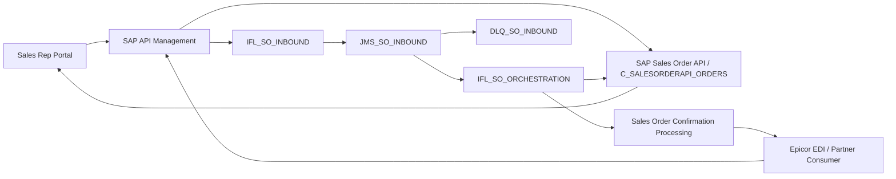

# Technical Blueprint

## 1. Objective

Build the first implementation skeleton for the Oatey SAP BTP inbound sales order integration using the approved architecture in `architecture/architecture.md` and the detailed inbound flow in `architecture/inbound-flow.md`.

The design supports two patterns:

- Synchronous Sales Rep Portal traffic through SAP API Management directly to the standard SAP Sales Order API.
- Asynchronous EDI and partner traffic through SAP API Management, SAP Integration Suite, JMS buffering, orchestration, and callback notification.

## 2. Mandatory Architecture Alignment

| Principle | Implementation Direction |
| --- | --- |
| SAP Clean Core | Use standard SAP Sales Order APIs only. No RFC, BAPI, custom Z services, or S/4HANA core modifications. |
| API First | All consumer entry points are exposed and governed through SAP API Management. |
| Reprocessing Ready | Every asynchronous message carries a correlation ID and idempotency key. |
| Loose Coupling | CPI and JMS decouple asynchronous consumers from SAP backend processing. |
| Consumer Agnostic | Consumer-specific behavior lives in API products, mappings, and configuration. |
| Retry and Recovery | Retry transient failures with exponential backoff, then route exhausted messages to DLQ. |
| Observability | Log correlation ID, consumer ID, status, error category, and timestamps at every step. |

## 3. Runtime Topology

## 4. API Management Skeleton

API Management owns authentication, authorization, quota, rate limiting, API versioning, analytics, and consumer isolation.

Initial API products:

| API Product | Consumer | Pattern | Target |
| --- | --- | --- | --- |
| `REP_PORTAL_API` | Sales Rep Portal | Synchronous | S/4HANA Sales Order API |
| `EDL_SALES_ORDER_INBOUND_API` | Epicor HQ / EDI Translator | Asynchronous | `IFL_SO_INBOUND` |
| `CONSUMER_A_API` | Future partners | Asynchronous | `IFL_SO_INBOUND` |

API Management must not perform payload mapping, orchestration, or business logic.

## 5. Synchronous Sales Rep Portal Flow

The Sales Rep Portal path is direct pass-through for low latency:

1. Portal submits order to `REP_PORTAL_API`.
2. API Management authenticates, authorizes, rate limits, and tracks analytics.
3. API Management calls the standard SAP Sales Order API.
4. S/4HANA returns the sales order response.
5. Portal receives immediate order feedback.

Skeleton artifacts:

- `openapi/sales-rep-portal-api.yaml`
- `apim/README.md`

## 6. Asynchronous Inbound Flow

### IFL_SO_INBOUND

Responsibilities:

- Validate JSON/XML structure.
- Validate required fields per consumer contract.
- Generate correlation ID when absent.
- Enrich message with consumer metadata.
- Build the JMS message envelope.
- Publish to `JMS_SO_INBOUND`.
- Return ACK with correlation ID.

### JMS_SO_INBOUND

Configuration:

- Queue: `JMS_SO_INBOUND`
- Dead-letter queue: `DLQ_SO_INBOUND`
- Persistence: enabled
- TTL: 7 days
- Max retries before DLQ: 3

### IFL_SO_ORCHESTRATION

Responsibilities:

- Consume messages from `JMS_SO_INBOUND`.
- Check idempotency before creating sales orders.
- Transform canonical payload to SAP Sales Order API format.
- Call standard SAP API `C_SALESORDERAPI_ORDERS`.
- Classify response as success, validation, business, transient, or system failure.
- Trigger callback flow when the consumer has a callback URL.

### Sales Order Confirmation Processing

Responsibilities:

- Build callback payload.
- Resolve consumer callback URL.
- POST result to consumer endpoint.
- Retry callback delivery up to five times.
- Log final callback status with correlation ID.

## 7. Contracts

Required contracts:

- `openapi/sales-order-inbound-api.yaml` for async inbound consumers.
- `openapi/sales-rep-portal-api.yaml` for synchronous portal consumers.
- `openapi/callback-notification-api.yaml` for callback payloads.
- `openapi/schemas/sales-order-request.json` for common order payload structure.
- `openapi/schemas/callback-payload.json` for confirmation callbacks.

## 8. Error Model

| Category | Retry | Handling |
| --- | --- | --- |
| VALIDATION | No | Return 400/422 or route to DLQ if discovered async. |
| BUSINESS_RULE | No | Return business error or send failed callback. |
| TRANSIENT | Yes | Retry with exponential backoff, then DLQ. |
| SYSTEM | Yes | Retry with exponential backoff, then DLQ. |
| AUTHENTICATION | No | Reject request and alert if repeated. |

Retry schedule:

- Retry 1: 5 seconds
- Retry 2: 25 seconds
- Retry 3: 125 seconds

## 9. Observability

Every component must log these fields where applicable:

- `correlationId`
- `consumerId`
- `apiProductName`
- `idempotencyKey`
- `processingStatus`
- `salesOrderNumber`
- `errorCategory`
- `durationMs`
- ISO 8601 timestamp

Alerts:

- DLQ depth greater than zero.
- Processing latency greater than five minutes.
- Error rate greater than five percent.
- S/4HANA Sales Order API unavailable.

## 10. Build Sequence

1. Finalize OpenAPI contracts for asynchronous inbound, synchronous portal, and callbacks.
2. Configure API products and policies in SAP API Management.
3. Build `IFL_SO_INBOUND` validation, enrichment, and JMS publication.
4. Configure `JMS_SO_INBOUND` and `DLQ_SO_INBOUND`.
5. Build `IFL_SO_ORCHESTRATION` mapping and SAP API invocation.
6. Add callback confirmation processing.
7. Configure Integration Suite monitoring and Cloud ALM visibility.
8. Document consumer onboarding and operations procedures.
